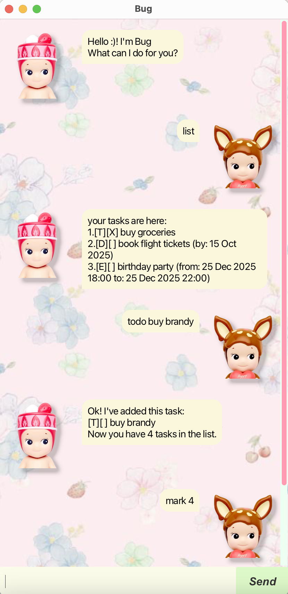

# Bug User Guide

Bug is a friendly task management chatbot that helps you keep track of your todo items, deadlines, and events through a simple conversational interface! :)

## Quick Start
1. Download the latest bug.jar file from the releases
2. Double-click the jar file to launch Bug
3. Type commands in the text box and press Enter or click "Send"
4. Bug will respond and help you manage your tasks!

## Features
### Adding Tasks
#### Add a Todo Task
Add a simple task without a specific date.
 format: todo <description>
 Example:
* todo buy groceries
* todo do laundry
#### Add a Deadline Task
Add a task with a due date.
 Format: deadline <description> /by <date>
* Date format: yyyy-MM-dd

Example:
* deadline submit assignment /by 2025-10-15
* deadline pay bills /by 2025-12-01
#### Add an Event Task
Add a task with start and end times.
 Format: event <description> /from <start> /to <end>
* DateTime format: yyyy-MM-dd HHmm

Example:
* event project meeting /from 2024-10-15 1400 /to 2024-10-15 1600
* event birthday party /from 2024-12-25 1800 /to 2024-12-25 2200
### Managing Tasks
#### List All Tasks
View all your current tasks.
 Format: list
#### Mark Task as Done
Mark a completed task.
 Format: mark <task number>
 Example: mark 1
#### Unmark Task
Mark a task as not done.
 Format: unmark <task number>
 Example: unmark 2
#### Delete Task
Remove a task from your list.
 Format: delete <task number>
 Example: delete 3
### Finding Tasks
#### Search Tasks
Find tasks containing specific keywords.
 Format: find <keyword>
 Example:
* find book - finds tasks containing "book"
* find meeting - finds tasks containing "meeting"
### Advanced Features
#### Snooze Tasks
Postpone deadline or event tasks by a specified duration.
 Format: snooze <task number> <duration>
* Duration format: <number><unit> where unit is d (days), h (hours), or m (minutes)

Example:
* snooze 1 3d - postpone task 1 by 3 days
* snooze 2 2h - postpone task 2 by 2 hours
  *Note: Todo tasks cannot be snoozed as they don't have dates.*
### Other Commands
#### Exit
Close Bug.
 Format: bye
### Tips
* Task numbers start from 1 and are shown when you use the list command
* Bug automatically saves your tasks, so you won't lose them when you close the application
* If you make a mistake in a command, Bug will show you a helpful error message
* Commands are case-insensitive, so LIST, list, and List all work the same way
### Command Summary
| Action | Format | Example |
| ------ | ------ | ------- |
| Add Todo | `todo <description>` | `todo buy milk` |
| Add Deadline | `deadline <description> /by <date>` | `deadline essay /by 2024-12-01` |
| Add Event | `event <description> /from <start> /to <end>` | `event meeting /from 2024-12-01 1000 /to 2024-12-01 1200` |
| List | `list` | `list` |
| Mark Done | `mark <number>` | `mark 1` |
| Unmark | `unmark <number>` | `unmark 1` |
| Delete | `delete <number>` | `delete 1` |
| Find | `find <keyword>` | `find homework` |
| Snooze | `snooze <number> <duration>` | `snooze 1 2d` |
| Exit | `bye` | `bye` |
### Troubleshooting
#### Bug won't start?
* Make sure you have Java 11 or later installed
* Try running from command line: java -jar bug.jar
#### Tasks not saving?
* Check that Bug has permission to create files in the folder where you're running it
* Bug saves tasks to a data folder in the same location as the jar file
#### Getting error messages?
* Check the command format matches the examples above
* Make sure dates are in the correct format (yyyy-MM-dd)
* Task numbers should be positive integers
___
Happy task managing with Bug!!!